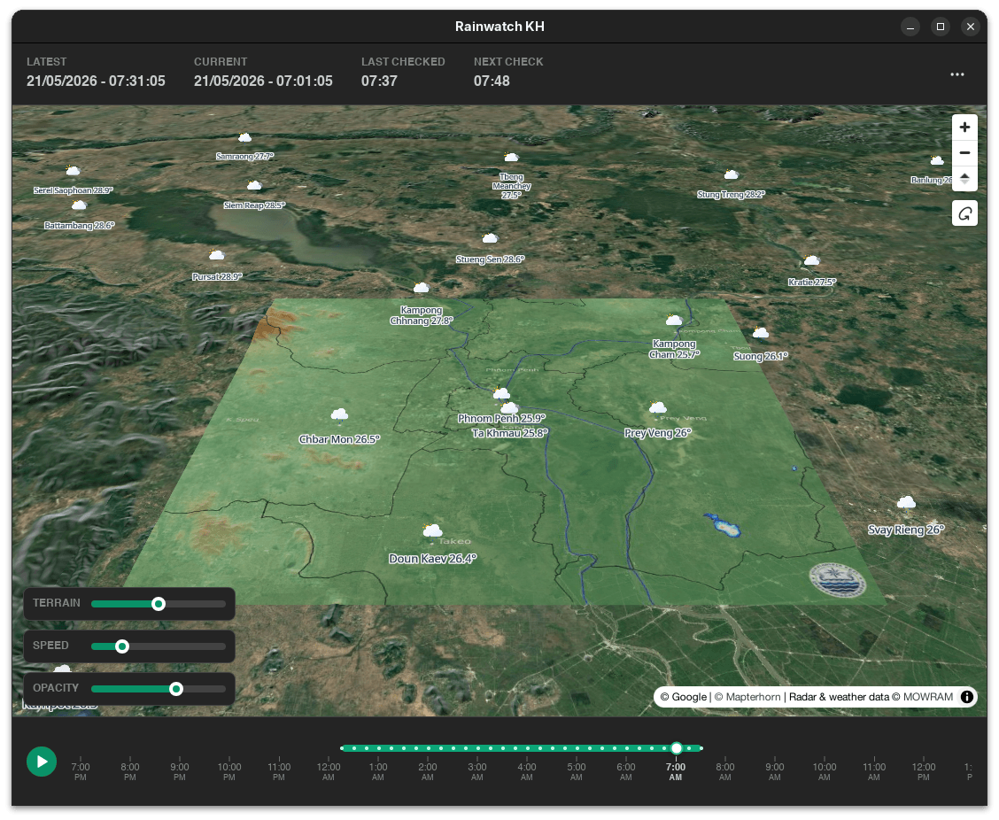

# Cambodia Radar Desktop Viewer

A minimal desktop app for viewing the latest Cambodia Meteo radar animation,
built with [Tauri v2](https://v2.tauri.app/).



## Features

- Cambodia Meteo radar — PHN (80 km), 240 km, and Cambodia (450 km) domains
- Animated playback with timeline scrubber and adjustable speed
- Hourly weather forecasts and provincial capital conditions from Open-Meteo
- 3D terrain with switchable basemap styles
- Auto-rotate when idle for ambient display
- Native installers for Linux, Windows, and macOS

## Develop

```bash
npm install
npm run tauri dev
```

`npm run tauri dev` compiles the Rust backend and serves the renderer with
hot-reload.

## Test

```bash
npm test                                          # renderer + shared JS tests
cargo test --manifest-path src-tauri/Cargo.toml    # Rust commands and parser
```

The Rust suite includes a live network smoke test that is skipped by default;
run it with `cargo test --manifest-path src-tauri/Cargo.toml -- --ignored`.

## Build installers

```bash
npm run tauri build
```

Bundles are written to `src-tauri/target/release/bundle/`. A build produces
installers only for the host OS:

| Host OS | Installers            |
| ------- | --------------------- |
| Linux   | `.deb`, `.AppImage`   |
| Windows | `.exe` (NSIS), `.msi` |
| macOS   | `.app`, `.dmg`        |

### Build prerequisites

- **All platforms:** [Rust](https://rustup.rs/) (stable) and Node.js 20+.
- **Linux:** `libwebkit2gtk-4.1-dev`, `librsvg2-dev`, `patchelf`,
  `build-essential`, `libssl-dev` (see `.github/workflows/release.yml` for the
  full list).
- **Windows:** the MSVC build tools; the WebView2 runtime (preinstalled on
  current Windows).
- **macOS:** the Xcode Command Line Tools.

## Release

Pushing a `v*` tag runs `.github/workflows/release.yml`, which builds every
installer on Linux, Windows, and macOS runners and uploads them to a **draft**
GitHub Release:

```bash
git tag v0.1.0
git push origin v0.1.0
```

Review the draft release, then publish it.

Release builds are **unsigned** — macOS Gatekeeper and Windows SmartScreen warn
on first launch. For public distribution, add Apple notarization and Windows
code-signing credentials as workflow secrets.

## Scope

V1 supports the Cambodia Meteo radar slideshow domains:

- `PHN` / 80 KM
- `240KM` / 240 KM
- `CAMBODIA` / 450 KM

The app fetches the public slideshow page in a Rust command, parses the radar
image arrays, and displays a looping animation in the renderer.

## Map Context

The MapLibre context layer is configured in `renderer/src/lib/map-config.ts`.
Edit `styleUrl` to use a trusted MapLibre style URL, and tune each domain's
`center`, `zoom`, and `coordinates` values there to align the georeferenced
radar overlay.

The app crops the left `800x800` radar panel from each `1069x800` Cambodia
Meteo frame and renders it as a MapLibre `image` source.

### Re-calibrating corner coordinates (dev only)

Run `npm run tauri dev -- --calibrate` (or `--debug-positioning`) to enable an
on-screen panel for nudging the four corners, scaling, and rotating the
overlay; it prints an updated `coordinates` snippet to paste back into
`map-config.ts`. The panel is gated by `is_calibration_enabled` in
`src-tauri/src/lib.rs` and is hidden in release builds — it is not part of the
end-user UI.

MapLibre styles must provide their own tile sources, glyphs, sprites, and
attribution. Do not use `mapbox://` style URLs or commit provider API keys.
